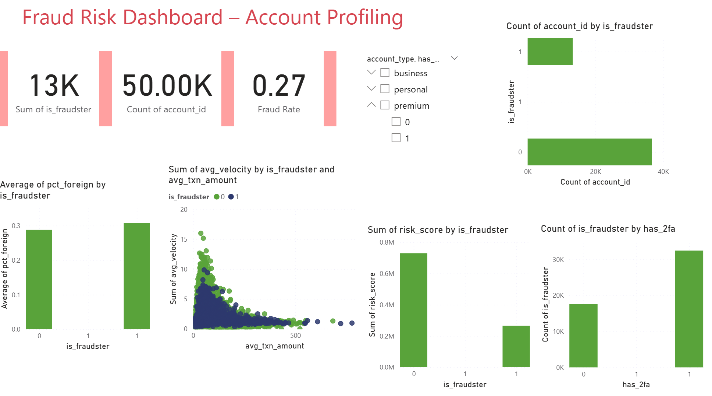

# Fraud Risk Profiling & Detection

## Objective
Analyze account-level data to identify fraud patterns and key risk indicators.

## Tools Used
- Python (Pandas, Seaborn)
- Power BI
- Machine Learning (Random Forest)

## Key Insights
- Accounts with higher risk scores showed significantly higher fraud probability
- Lack of 2FA was strongly associated with fraudulent activity
- High percentage of foreign transactions indicated increased fraud risk
- Transaction velocity and behavior patterns helped identify suspicious accounts

## Dashboard

## Outcome
Developed a data-driven approach to identify high-risk accounts and support fraud prevention strategies.
